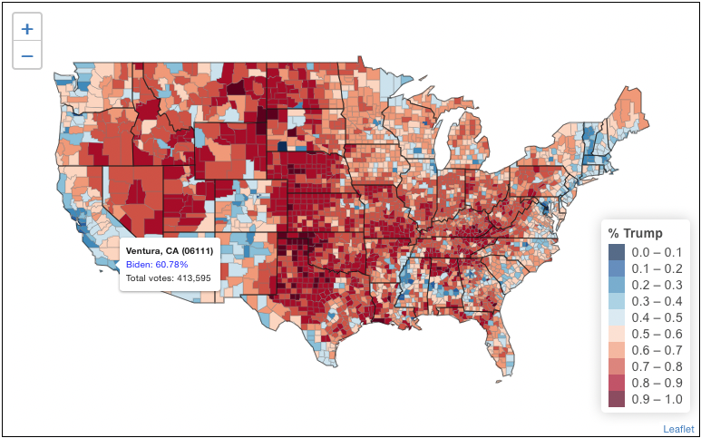

--- 
title: "US Presidential Election Data Visualization"
author: Alec Nguyen^[https://alecng27.github.io/Project_Portfolio/], Bruno Sotelo, Michael Zhang
site: bookdown::bookdown_site
bibliography: references.bib
biblio-style: apalike
link-citations: yes
---



# About {-}

Project Source Code - https://github.com/alecng27/US_Presidential_Election_Map

See the [LICENSE](https://github.com/alecng27/US_Presidential_Election_Map/blob/main/LICENSE) file for license rights and limitations.

The **American Community Survey (ACS)** is a demographics survey program conducted by the **U.S. Census Bureau**. 

**ACS** regularly gathers information previously contained only in the long form of the decennial census, such as `ancestry`, `citizenship`, `educational attainment`, `income`, `language proficiency`, `migration`, `disability`, `employment`, and `housing characteristics`. These data are used by many public-sector, private-sector, and not-for-profit stakeholders to allocate funding, track shifting demographics, plan for emergencies, and learn about local communities.

For this project, I utilized the **2019 ACS data** to explore and compare the **2020 US Presidential Election results** against the county-level demographic data.


<!--chapter:end:index.Rmd-->

# Data

## GIS data download and preparation
```{r, message=FALSE, warning=FALSE, include=TRUE}
library(tidyverse)
library(leaflet)
library(rmapshaper)
library(tidycensus)
library(stargazer)
library(scales)
library(sf)
library(pander)

options(tigris_use_cache = TRUE)

## turn off scientific notation
options(scipen = 5)

```

```{r, message=FALSE, warning=FALSE, include=TRUE}
## Download GIS data for maps
##   geometry = TRUE --> GIS shapefile data to create maps
##   B01001_001: total population
##   NOTE: When you download the county data for the regressions, use options: geometry = FALSE,keep_geo_vars = FALSE

# county-level data for population
countyGIS <- get_acs(geography = "county",
              variables = "B01001_001",
              geometry = TRUE,
              keep_geo_vars = TRUE)

# State data (for displaying state borders on map)
stateGIS <- get_acs(geography = "state",
              variables = "B01001_001",
              geometry = TRUE,
              keep_geo_vars = FALSE)


## Simplify GIS data to make file sizes smaller. This essentially removes some details along coastlines and very-not-straight borders. 
stateGIS <- ms_simplify(stateGIS, keep = 0.01)
countyGIS <- ms_simplify(countyGIS, keep = 0.01)


countyGIS <- countyGIS %>% 
                select(FIPS = GEOID, 
                       stFIPS = STATEFP, 
                       coFIPS = COUNTYFP, 
                       coNAME = NAME.x, 
                       pop = estimate, 
                       geometry)


## For maps, drop the following: 
##   Puerto Rico (ST FIPS 72) (no election data)
##   Alaska (ST FIPS 02) (voting data isn't reported by county...we could also map the legislative districts, but we're not going to since we'd rather have smaller maps without those extra details)
##   Hawaii (ST FIPS 15) (so our map can zoom in on continental 48 states)
countyGIS <- countyGIS %>% filter(stFIPS != "72" & stFIPS != "02")
stateGIS <- stateGIS %>% filter(GEOID != "72" & GEOID != "02" & GEOID != "15")


## join 2-character state abbreviation and create name = county, ST for labeling maps
fipsToSTcode <- fips_codes %>% select(stFIPS = state_code, stNAME = state) %>% unique()

countyGIS <- inner_join(countyGIS,fipsToSTcode,by="stFIPS")

countyGIS <- countyGIS %>% mutate(name = paste0(coNAME,", ", stNAME))


## NOTE: If you don't use keep_geo_vars = TRUE, you don't get separate STATEFP and COUNTYFP, but you can use mutate() and create stFIPS = substr(GEOID,1,2) and coFIPS = substr(GEOID,3,5)
```

**Category 1 variable 1**
```{r, message=FALSE, warning=FALSE, include=TRUE}
white <- get_acs(geography = "county",
              variables = "B01001A_001",
              geometry = FALSE,
              keep_geo_vars = TRUE)

white_filtered <- white %>%
                select(FIPS = GEOID, 
                       pop_white = estimate,
                       moe_white = moe)


countyGIS <- countyGIS %>%
  inner_join(white_filtered, by = "FIPS") %>%
  mutate(pct_white = 100 * pop_white / pop) 

```

**Category 1 variable 2**
```{r, message=FALSE, warning=FALSE, include=TRUE}
asian <- get_acs(geography = "county",
              variables = "B01001D_001",
              geometry = FALSE,
              keep_geo_vars = TRUE)

asian_filtered <- asian %>%
                select(FIPS = GEOID, 
                       pop_asian = estimate,
                       moe_asian = moe)


countyGIS <- countyGIS %>%
  inner_join(asian_filtered, by = "FIPS") %>%
  mutate(pct_asian = 100 * pop_asian / pop) 

```

**Category 2 variable 1**
```{r, message=FALSE, warning=FALSE, include=TRUE}
white_age <- get_acs(geography = "county",
              variables = c("B01001A_007", "B01001A_008", "B01001A_009", "B01001A_010", "B01001A_011", "B01001A_012", "B01001A_013", "B01001A_014", "B01001A_015", "B01001A_016", "B01001A_022", "B01001A_023", "B01001A_024", "B01001A_025", "B01001A_026", "B01001A_027", "B01001A_028", "B01001A_029", "B01001A_030", "B01001A_031"),
              geometry = FALSE,
              keep_geo_vars = TRUE, output = "wide")

whiteage_filtered <- white_age %>% 
  mutate(estimate = c(B01001A_007E + B01001A_008E + B01001A_009E + B01001A_010E + B01001A_011E + B01001A_012E + B01001A_013E + B01001A_014E + B01001A_015E + B01001A_016E + B01001A_022E + B01001A_023E + B01001A_024E + B01001A_025E + B01001A_026E + B01001A_027E + B01001A_028E + B01001A_029E + B01001A_030E + B01001A_031E)) %>% 
  mutate(moe = B01001A_007M + B01001A_008M + B01001A_009M + B01001A_010M + B01001A_011M + B01001A_012M + B01001A_013M + B01001A_014M + B01001A_015M + B01001A_016M + B01001A_022M + B01001A_023M + B01001A_024M + B01001A_025M + B01001A_026M + B01001A_027M + B01001A_028M + B01001A_029M + B01001A_030M + B01001A_031M) %>% select(FIPS = GEOID, 
                       pop_whiteage = estimate,
                       moe_whiteage = moe)
                       
countyGIS <- countyGIS %>%
  inner_join(whiteage_filtered, by = "FIPS") %>%
  mutate(pct_whiteage = 100 * pop_whiteage / pop) 

```

**Category 2 variable 2**
```{r, message=FALSE, warning=FALSE, include=TRUE}
asian_age <- get_acs(geography = "county",
              variables = c("B01001D_007", "B01001D_008", "B01001D_009", "B01001D_010", "B01001D_011", "B01001D_012", "B01001D_013", "B01001D_014", "B01001D_015", "B01001D_016", "B01001D_022", "B01001D_023", "B01001D_024", "B01001D_025", "B01001D_026", "B01001D_027", "B01001D_028", "B01001D_029", "B01001D_030", "B01001D_031"),
              geometry = FALSE,
              keep_geo_vars = TRUE, output = "wide")

asianage_filtered <- asian_age %>% 
  mutate(estimate = c(B01001D_007E + B01001D_008E + B01001D_009E + B01001D_010E + B01001D_011E + B01001D_012E + B01001D_013E + B01001D_014E + B01001D_015E + B01001D_016E + B01001D_022E + B01001D_023E + B01001D_024E + B01001D_025E + B01001D_026E + B01001D_027E + B01001D_028E + B01001D_029E + B01001D_030E + B01001D_031E)) %>% 
  mutate(moe = B01001D_007M + B01001D_008M + B01001D_009M + B01001D_010M + B01001D_011M + B01001D_012M + B01001D_013M + B01001D_014M + B01001D_015M + B01001D_016M + B01001D_022M + B01001D_023M + B01001D_024M + B01001D_025M + B01001D_026M + B01001D_027M + B01001D_028M + B01001D_029M + B01001D_030M + B01001D_031M) %>% select(FIPS = GEOID, 
                       pop_asianage = estimate,
                       moe_asianage = moe)
                       

countyGIS <- countyGIS %>%
  inner_join(asianage_filtered, by = "FIPS") %>%
  mutate(pct_asianage = 100 * pop_asianage / pop)

```

**Category 3 variable 1**
```{r, message=FALSE, warning=FALSE, include=TRUE}
us_citizen_us_born <- get_acs(geography = "county",
              variables = "B05001_002",
              geometry = FALSE,
              keep_geo_vars = TRUE)

us_citizen_us_born_filtered <- us_citizen_us_born %>%
                select(FIPS = GEOID, 
                       pop_us_born = estimate,
                       moe_us_born = moe)


countyGIS <- countyGIS %>%
  inner_join(us_citizen_us_born_filtered, by = "FIPS") %>%
  mutate(pct_us_born = 100 * pop_us_born / pop) 

```

**Category 3 variable 2**
```{r, message=FALSE, warning=FALSE, include=TRUE}
us_citizen_naturalized <- get_acs(geography = "county",
              variables = "B05001_005",
              geometry = FALSE,
              keep_geo_vars = TRUE)

us_citizen_naturalized_filtered <- us_citizen_naturalized %>%
                select(FIPS = GEOID, 
                       pop_us_naturalized = estimate,
                       moe_us_naturalized = moe)

countyGIS <- countyGIS %>%
  inner_join(us_citizen_naturalized_filtered, by = "FIPS") %>%
  mutate(pct_us_naturalized = 100 * pop_us_naturalized / pop) 

```

**Category 4 variable 1**
```{r, message=FALSE, warning=FALSE, include=TRUE}
employment_male <- get_acs(geography = "county",
              variables = "B23001_002",
              geometry = FALSE,
              keep_geo_vars = TRUE)

employment_male_filtered <- employment_male %>%
                select(FIPS = GEOID, 
                       pop_employment_male = estimate,
                       moe_employment_male = moe)


countyGIS <- countyGIS %>%
  inner_join(employment_male_filtered, by = "FIPS") %>%
  mutate(pct_employment_male = 100 * pop_employment_male / pop)

```

**Category 4 variable 2**
```{r, message=FALSE, warning=FALSE, include=TRUE}
employment_female <- get_acs(geography = "county",
              variables = "B23001_088",
              geometry = FALSE,
              keep_geo_vars = TRUE)

employment_female_filtered <- employment_female %>%
                select(FIPS = GEOID, 
                       pop_employment_female = estimate,
                       moe_employment_female = moe)


countyGIS <- countyGIS %>%
  inner_join(employment_female_filtered, by = "FIPS") %>%
  mutate(pct_employment_female = 100 * pop_employment_female / pop) 

```


## Election data download and preparation

Now we're going to download 2020 county-level election results from a GitHub repo. You can read more about the data [in the repo](https://github.com/tonmcg/US_County_Level_Election_Results_08-20). 

```{r, message=FALSE, warning=FALSE, include=TRUE}
## 2020 Election data
dta2020 <- read_csv("https://raw.githubusercontent.com/tonmcg/US_County_Level_Election_Results_08-20/master/2020_US_County_Level_Presidential_Results.csv")

## Calculate percentages based on total votes for Trump and Biden (GOP and Dem) only
##   In some years there have been ties, so we're allowing for that
##   stdVotes and stdVotesLog will be used to scale color opacitiy from 0 to 1 based on total votes

dta2020 <- dta2020 %>% 
            mutate(pctGOP = votes_gop/(votes_gop + votes_dem),
                   totalVotes = votes_gop + votes_dem,
                   winner = ifelse(dta2020$votes_gop > dta2020$votes_dem,"Trump",
                                   ifelse(dta2020$votes_gop < dta2020$votes_dem,"Biden", 
                                          "Tie")),
                   pctWinner = ifelse(dta2020$votes_gop > dta2020$votes_dem,pctGOP,1-pctGOP),
                   FontColorWinner = ifelse(dta2020$votes_gop > dta2020$votes_dem,"red",
                                      ifelse(dta2020$votes_gop < dta2020$votes_dem,"blue",
                                             "purple")),
                   pctGOPcategories = ifelse(pctGOP<0.48,"0-48%", 
                                             ifelse(pctGOP<0.5,"48-50%", 
                                                    ifelse(pctGOP<0.52, "50-52%",
                                                           "52-100%"))),
                   stdVotes = (totalVotes-min(totalVotes))/(max(totalVotes)-min(totalVotes)),
                   stdVotesLog = (log(totalVotes)-min(log(totalVotes)))/(max(log(totalVotes))-min(log(totalVotes)))
                   )


dta2020 <- dta2020 %>% 
            select(FIPS =  county_fips, pctGOP, totalVotes, winner, pctWinner, pctGOPcategories, FontColorWinner, stdVotes, stdVotesLog)


## merge GIS data with voting data

countyGIS <- left_join(countyGIS,dta2020,by="FIPS")

## For maps, drop the following: 
##   Hawaii (ST FIPS 15) (so our map can zoom in on continental 48 states)
countyGIS_map <- countyGIS %>% filter(stFIPS != "15")

```

<style>
.sumstats td {
  text-align: right;
  color: green;
}
</style>

## Summary Statistics {.sumstats}

```{r,warning=FALSE,message=FALSE,results="asis"}
countyGIS_stat <- st_drop_geometry(countyGIS)

countyGIS_stat <- countyGIS_stat %>%
  select(pctGOP, totalVotes, pct_white, pct_asian, pct_whiteage, pct_asianage, pct_us_born, pct_us_naturalized, pct_employment_male, pct_employment_female)


stargazer(countyGIS_stat, type = "html",summary.stat = c("mean","sd", "min", "median", "max"))
```


<!--chapter:end:01-Data.Rmd-->

# Election Map
```{r, message=FALSE, warning=FALSE, include=TRUE}
popupLabels <- paste0("<b>",countyGIS_map$name," (",countyGIS_map$FIPS,")</b>",
                    "<br><font color='",countyGIS_map$FontColorWinner,"'>",countyGIS_map$winner, 
                    ": ",
                    format(countyGIS_map$pctWinner*100,digits=4, trim=TRUE),
                    "%</font>",
                    "<br>Total votes: ", format(countyGIS_map$totalVotes,big.mark=",", trim=TRUE)
                    ) %>% 
              lapply(htmltools::HTML)
```

```{r, message=FALSE, warning=FALSE, include=TRUE}
pal <- colorBin("RdBu", countyGIS_map$pctGOP, n = 9, reverse=TRUE)

leaflet(countyGIS_map, options = leafletOptions(crsClass = "L.CRS.EPSG3857"), width="100%") %>%
  addPolygons(weight = 0.5, color = "gray", opacity = 0.7,
    fillColor = ~pal(pctGOP), fillOpacity = 1, smoothFactor = 0.5,
    label = popupLabels,
    labelOptions = labelOptions(direction = "auto")) %>%
    addPolygons(data = stateGIS,fill = FALSE,color="black",weight = 1) %>%
    addLegend(pal = pal,values = ~countyGIS_map$pctGOP, opacity = 0.7, title = "% Trump",position = "bottomright")

```

<!--chapter:end:02-ElectionMap.Rmd-->

# Category 1: Race

This category shows the population of the country by race. The first variable `pct_white` is the percentage of the White population in the U.S. The second variable `pct_asian` is the percentage of the Asian population in the U.S.


## Category 1 Variable 1: White Population

[Map]

```{r, message=FALSE, warning=FALSE, include=TRUE}
popupLabels_white <- paste0("<b>",countyGIS_map$name," (",countyGIS_map$FIPS,")</b>",
                    "<br><font color='",countyGIS_map$FontColorWinner,"'>",countyGIS_map$winner, 
                    ": ",
                    format(countyGIS_map$pctWinner*100,digits=4, trim=TRUE),
                    "%</font>",
                    "<br>Total votes: ", format(countyGIS_map$totalVotes,big.mark=",", trim=TRUE),
                    "<br>Percent White: ", format(round(countyGIS_map$pct_white, 2),big.mark=",", trim=TRUE),
                    "%</font>"
                    ) %>% 
              lapply(htmltools::HTML)
```

```{r, message=FALSE, warning=FALSE, include=TRUE}
pal <- colorBin("Greys", countyGIS_map$pct_white,bins = c(0, 20, 40, 60, 80, 100), reverse=TRUE)


leaflet(countyGIS_map, options = leafletOptions(crsClass = "L.CRS.EPSG3857"), width="100%") %>%
  addPolygons(weight = 0.5, color = "gray", opacity = 0.7,
    fillColor = ~pal(pct_white), fillOpacity = 1, smoothFactor = 0.5,
    label = popupLabels_white,
    labelOptions = labelOptions(direction = "auto")) %>%
    addPolygons(data = stateGIS,fill = FALSE,color="black",weight = 1) %>%
    addLegend(pal = pal,values = ~countyGIS_map$pct_white, opacity = 0.7, title = "% White",position = "bottomright")

```


[Scatter plot]

```{r, message=FALSE, warning=FALSE, include=TRUE}
pct_white_vs_pctGOP <- ggplot(countyGIS_stat, aes(pct_white, pctGOP)) + 
  geom_point(aes(alpha = pct_white, shape = ".")) + 
  geom_smooth(method = "lm", se = FALSE) 

pct_white_vs_pctGOP

```


[Regression]

```{r}
# Estimate regression model
pct_white_reg <- lm(pctGOP ~ pct_white, data=countyGIS_stat)

# Display model results
pander(summary(pct_white_reg))
```

## Category 1 Variable 2: Asian Population

[Map]

```{r, message=FALSE, warning=FALSE, include=TRUE}
popupLabels_Asian <- paste0("<b>",countyGIS_map$name," (",countyGIS_map$FIPS,")</b>",
                    "<br><font color='",countyGIS_map$FontColorWinner,"'>",countyGIS_map$winner, 
                    ": ",
                    format(countyGIS_map$pctWinner*100,digits=4, trim=TRUE),
                    "%</font>",
                    "<br>Total votes: ", format(countyGIS_map$totalVotes,big.mark=",", trim=TRUE),
                    "<br>Percent Asian: ", format(round(countyGIS_map$pct_asian, 2),big.mark=",", trim=TRUE),
                    "%</font>"
                    ) %>% 
              lapply(htmltools::HTML)
```

```{r, message=FALSE, warning=FALSE, include=TRUE}

pal2 <- colorNumeric(
  palette = colorRampPalette(c('yellow', 'white'))(length(countyGIS_map$pct_asian)), 
  domain = countyGIS_map$pct_asian, reverse=TRUE)

leaflet(countyGIS_map, options = leafletOptions(crsClass = "L.CRS.EPSG3857"), width="100%") %>%
  addPolygons(weight = 0.5, color = "gray", opacity = 0.7,
    fillColor = ~pal2(pct_asian), fillOpacity = 1, smoothFactor = 0.5,
    label = popupLabels_Asian,
    labelOptions = labelOptions(direction = "auto")) %>%
    addPolygons(data = stateGIS,fill = FALSE,color="black",weight = 1) %>%
    addLegend(pal = pal2,values = ~countyGIS_map$pct_asian, opacity = 0.7, title = "% Asian",position = "bottomright")
```


[Scatter plot]

```{r, message=FALSE, warning=FALSE, include=TRUE}
pct_asian_vs_pctGOP <- ggplot(countyGIS_stat, aes(pct_asian, pctGOP)) + 
  geom_point(aes(alpha = pct_asian, shape = ".")) + 
  geom_smooth(method = "lm", se = FALSE) 
  
pct_asian_vs_pctGOP
```


[Regression]

```{r}
# Estimate regression model
pct_asian_reg <- lm(pctGOP ~ pct_asian, data=countyGIS_stat)

# Display model results
pander(summary(pct_asian_reg))
```


<!--chapter:end:03-Category1.Rmd-->

# Category 2: Race and Age

This category shows the population of the country by race and age. The first variable `pct_whiteage` is the percentage of the White population in the U.S that are 18 years old or older. The second variable `pct_asian` is the percentage of the Asian population in the U.S. that are 18 years old or older.

## Category 2 Variable 1: White Adults

[map]

```{r, message=FALSE, warning=FALSE, include=TRUE}
popupLabels_WhiteAge <- paste0("<b>",countyGIS_map$name," (",countyGIS_map$FIPS,")</b>",
                    "<br><font color='",countyGIS_map$FontColorWinner,"'>",countyGIS_map$winner, 
                    ": ",
                    format(countyGIS_map$pctWinner*100,digits=4, trim=TRUE),
                    "%</font>",
                    "<br>Total votes: ", format(countyGIS_map$totalVotes,big.mark=",", trim=TRUE),
                    "<br>Percent White Age: ", format(round(countyGIS_map$pct_whiteage, 2),big.mark=",", trim=TRUE),
                    "%</font>"
                    ) %>% 
              lapply(htmltools::HTML)
```

```{r, message=FALSE, warning=FALSE, include=TRUE}

pal <- colorNumeric(
  palette = colorRampPalette(c('Pink', 'white'))(length(countyGIS_map$pct_whiteage)), 
  domain = countyGIS_map$pct_whiteage, reverse=TRUE)

leaflet(countyGIS_map, options = leafletOptions(crsClass = "L.CRS.EPSG3857"), width="100%") %>%
  addPolygons(weight = 0.5, color = "gray", opacity = 0.7,
    fillColor = ~pal(pct_whiteage), fillOpacity = 1, smoothFactor = 0.5,
    label = popupLabels_WhiteAge,
    labelOptions = labelOptions(direction = "auto")) %>%
    addPolygons(data = stateGIS,fill = FALSE,color="black",weight = 1) %>%
    addLegend(pal = pal,values = ~countyGIS_map$pct_whiteage, opacity = 0.7, title = "% White Age",position = "bottomright")

```


[Scatter plot]

```{r, message=FALSE, warning=FALSE, include=TRUE}
pct_whiteage_vs_pctGOP <- ggplot(countyGIS_stat, aes(pct_whiteage, pctGOP)) + 
  geom_point(aes(alpha = pct_whiteage, shape = ".")) + 
  geom_smooth(method = "lm", se = FALSE) 
  
pct_whiteage_vs_pctGOP
```


[Regression]

```{r}
# Estimate regression model
pct_whiteage_reg <- lm(pctGOP ~ pct_whiteage, data=countyGIS_stat)

# Display model results
pander(summary(pct_whiteage_reg))
```

## Category 2 Variable 2: Asian Adults

[Map]

```{r, message=FALSE, warning=FALSE, include=TRUE}
popupLabels_AsianAge <- paste0("<b>",countyGIS_map$name," (",countyGIS_map$FIPS,")</b>",
                    "<br><font color='",countyGIS_map$FontColorWinner,"'>",countyGIS_map$winner, 
                    ": ",
                    format(countyGIS_map$pctWinner*100,digits=4, trim=TRUE),
                    "%</font>",
                    "<br>Total votes: ", format(countyGIS_map$totalVotes,big.mark=",", trim=TRUE),
                    "<br>Percent Asian Age: ", format(round(countyGIS_map$pct_asianage, 2),big.mark=",", trim=TRUE),
                    "%</font>"
                    ) %>% 
              lapply(htmltools::HTML)
```

```{r, message=FALSE, warning=FALSE, include=TRUE}
pal <- colorNumeric(
  palette = colorRampPalette(c('Orange', 'White'))(length(countyGIS_map$pct_asianage)), 
  domain = countyGIS_map$pct_asianage, reverse=TRUE)

leaflet(countyGIS_map, options = leafletOptions(crsClass = "L.CRS.EPSG3857"), width="100%") %>%
  addPolygons(weight = 0.5, color = "gray", opacity = 0.7,
    fillColor = ~pal(pct_asianage), fillOpacity = 1, smoothFactor = 0.5,
    label = popupLabels_AsianAge,
    labelOptions = labelOptions(direction = "auto")) %>%
    addPolygons(data = stateGIS,fill = FALSE,color="black",weight = 1) %>%
    addLegend(pal = pal,values = ~countyGIS_map$pct_asianage, opacity = 0.7, title = "% Asian Age",position = "bottomright")

```


[Scatter plot]

```{r, message=FALSE, warning=FALSE, include=TRUE}
pct_asianage_vs_pctGOP <- ggplot(countyGIS_stat, aes(pct_asianage, pctGOP)) + 
  geom_point(aes(alpha = pct_asianage, shape = ".")) + 
  geom_smooth(method = "lm", se = FALSE) 
  
pct_asianage_vs_pctGOP
```


[Regression]

```{r}
# Estimate regression model
pct_asianage_reg <- lm(pctGOP ~ pct_asianage, data=countyGIS_stat)

# Display model results
pander(summary(pct_asianage_reg))
```


<!--chapter:end:04-Category2.Rmd-->

# Category 3: Nativity AND Citizenship Status

This category shows the population of the country by nativity and citizenship status. The first variable `pct_us_born` is the percentage of the population that is a U.S citizen born in the United States. The second variable `pct_us_naturalized` is the percentage of the population that is a U.S citizen by naturalization.

## Category 3 Variable 1: Native-born U.S citizen 

[Map]

```{r, message=FALSE, warning=FALSE, include=TRUE}
popupLabels_nativeborn <- paste0("<b>",countyGIS_map$name," (",countyGIS_map$FIPS,")</b>",
                    "<br><font color='",countyGIS_map$FontColorWinner,"'>",countyGIS_map$winner, 
                    ": ",
                    format(countyGIS_map$pctWinner*100,digits=4, trim=TRUE),
                    "%</font>",
                    "<br>Total votes: ", format(countyGIS_map$totalVotes,big.mark=",", trim=TRUE),
                    "<br>Percent Native-born: ", format(round(countyGIS_map$pct_us_born, 2),big.mark=",", trim=TRUE),
                    "%</font>"
                    ) %>% 
              lapply(htmltools::HTML)
```

```{r, message=FALSE, warning=FALSE, include=TRUE}
pal <- colorNumeric(
  palette = colorRampPalette(c('blue', 'white'))(length(countyGIS_map$pct_us_born)), 
  domain = countyGIS_map$pct_us_born, reverse=TRUE)

leaflet(countyGIS_map, options = leafletOptions(crsClass = "L.CRS.EPSG3857"), width="100%") %>%
  addPolygons(weight = 0.5, color = "gray", opacity = 0.7,
    fillColor = ~pal(pct_us_born), fillOpacity = 1, smoothFactor = 0.5,
    label = popupLabels_nativeborn,
    labelOptions = labelOptions(direction = "auto")) %>%
    addPolygons(data = stateGIS,fill = FALSE,color="black",weight = 1) %>%
    addLegend(pal = pal,values = ~countyGIS_map$pct_us_born, opacity = 0.7, title = "% Native-born",position = "bottomright")
```


[Scatter plot]

```{r}
ggplot(countyGIS_stat, aes(x=pct_us_born, y=pctGOP)) + geom_point(aes(alpha = pct_white, shape = ".")) + geom_smooth(method = "lm", se=FALSE)
```


[Regression]

```{r}
# Estimate regression model
pct_us_born_reg <- lm(pctGOP ~ pct_us_born, data=countyGIS_stat)

# Display model results
pander(summary(pct_us_born_reg))
```

## Category 2 Variable 2: Naturalized U.S citizen

[Map]

```{r, message=FALSE, warning=FALSE, include=TRUE}
popupLabels_naturalized <- paste0("<b>",countyGIS_map$name," (",countyGIS_map$FIPS,")</b>",
                    "<br><font color='",countyGIS_map$FontColorWinner,"'>",countyGIS_map$winner, 
                    ": ",
                    format(countyGIS_map$pctWinner*100,digits=4, trim=TRUE),
                    "%</font>",
                    "<br>Total votes: ", format(countyGIS_map$totalVotes,big.mark=",", trim=TRUE),
                    "<br>Percent Naturalized: ", format(round(countyGIS_map$pct_us_naturalized, 2),big.mark=",", trim=TRUE),
                    "%</font>"
                    ) %>% 
              lapply(htmltools::HTML)
```

```{r, message=FALSE, warning=FALSE, include=TRUE}
pal2 <- colorNumeric(
  palette = colorRampPalette(c('red', 'white'))(length(countyGIS_map$pct_us_naturalized)), 
  domain = countyGIS_map$pct_us_naturalized, reverse=TRUE)

leaflet(countyGIS_map, options = leafletOptions(crsClass = "L.CRS.EPSG3857"), width="100%") %>%
  addPolygons(weight = 0.5, color = "gray", opacity = 0.7,
    fillColor = ~pal2(pct_us_naturalized), fillOpacity = 1, smoothFactor = 0.5,
    label = popupLabels_naturalized,
    labelOptions = labelOptions(direction = "auto")) %>%
    addPolygons(data = stateGIS,fill = FALSE,color="black",weight = 1) %>%
    addLegend(pal = pal2,values = ~countyGIS_map$pct_us_naturalized, opacity = 0.7, title = "% Naturalized",position = "bottomright")
```


[Scatter plot]

```{r, message=FALSE, warning=FALSE, include=TRUE}
ggplot(countyGIS_stat, aes(pct_us_naturalized, pctGOP)) + geom_point(aes(alpha = pct_white, shape = ".")) + geom_smooth(method = "lm", se = FALSE) 
```


[Regression]

```{r}
# Estimate regression model
pct_us_naturalized_reg <- lm(pctGOP ~ pct_us_naturalized, data=countyGIS_stat)

# Display model results
pander(summary(pct_us_naturalized_reg))
```


<!--chapter:end:05-Category3.Rmd-->

# Category 4: Sex and Employment

This category shows the population of the country by sex and employment. The first variable `pct_male_employment` is the percentage of the male population 16 years old or older in the U.S. that is employed. The second variable `pct_female_employment` is the percentage of the female population 16 years old or older in the U.S. that is employed.


## Category 4 Variable 1: Male Employment

[Map]

```{r, message=FALSE, warning=FALSE, include=TRUE}
popupLabels_employment_male <- paste0("<b>",countyGIS_map$name," (",countyGIS_map$FIPS,")</b>",
                    "<br><font color='",countyGIS_map$FontColorWinner,"'>",countyGIS_map$winner, 
                    ": ",
                    format(countyGIS_map$pctWinner*100,digits=4, trim=TRUE),
                    "%</font>",
                    "<br>Total votes: ", format(countyGIS_map$totalVotes,big.mark=",", trim=TRUE),
                    "<br>Percent Male Employment: ", format(round(countyGIS_map$pct_employment_male, 2),big.mark=",", trim=TRUE),
                    "%</font>"
                    ) %>% 
              lapply(htmltools::HTML)
```

```{r, message=FALSE, warning=FALSE, include=TRUE}
pal <- colorNumeric(
  palette = colorRampPalette(c('blue', 'white'))(length(countyGIS_map$pct_employment_male)), 
  domain = countyGIS_map$pct_employment_male, reverse=TRUE)

leaflet(countyGIS_map, options = leafletOptions(crsClass = "L.CRS.EPSG3857"), width="100%") %>%
  addPolygons(weight = 0.5, color = "gray", opacity = 0.7,
    fillColor = ~pal(pct_employment_male), fillOpacity = 1, smoothFactor = 0.5,
    label = popupLabels_employment_male,
    labelOptions = labelOptions(direction = "auto")) %>%
    addPolygons(data = stateGIS,fill = FALSE,color="black",weight = 1) %>%
    addLegend(pal = pal,values = ~countyGIS_map$pct_employment_male, opacity = 0.7, title = "% Male Employment",position = "bottomright")
```

[Scatter plot]

```{r, message=FALSE, warning=FALSE, include=TRUE}
ggplot(countyGIS_stat, aes(pct_employment_male, pctGOP)) + 
  geom_point(aes(alpha = pct_white, shape = ".")) + 
               geom_smooth(method = "lm", se = FALSE) 
```


[Regression]

```{r}
# Estimate regression model
pct_employment_male_reg <- lm(pctGOP ~ pct_employment_male, data=countyGIS_stat)

# Display model results
pander(summary(pct_employment_male_reg))
```

## Category 4 Variable 2: Female Employment

[Map]

```{r, message=FALSE, warning=FALSE, include=TRUE}
popupLabels_employment_female <- paste0("<b>",countyGIS_map$name," (",countyGIS_map$FIPS,")</b>",
                    "<br><font color='",countyGIS_map$FontColorWinner,"'>",countyGIS_map$winner, 
                    ": ",
                    format(countyGIS_map$pctWinner*100,digits=4, trim=TRUE),
                    "%</font>",
                    "<br>Total votes: ", format(countyGIS_map$totalVotes,big.mark=",", trim=TRUE),
                    "<br>Percent Female Employment: ", format(round(countyGIS_map$pct_employment_female, 2),big.mark=",", trim=TRUE),
                    "%</font>"
                    ) %>% 
              lapply(htmltools::HTML)
```

```{r, message=FALSE, warning=FALSE, include=TRUE}
pal2 <- colorNumeric(
  palette = colorRampPalette(c('red', 'white'))(length(countyGIS_map$pct_employment_female)), 
  domain = countyGIS_map$pct_employment_female, reverse=TRUE)

leaflet(countyGIS_map, options = leafletOptions(crsClass = "L.CRS.EPSG3857"), width="100%") %>%
  addPolygons(weight = 0.5, color = "gray", opacity = 0.7,
    fillColor = ~pal2(pct_employment_female), fillOpacity = 1, smoothFactor = 0.5,
    label = popupLabels_employment_female,
    labelOptions = labelOptions(direction = "auto")) %>%
    addPolygons(data = stateGIS,fill = FALSE,color="black",weight = 1) %>%
    addLegend(pal = pal2,values = ~countyGIS_map$pct_employment_female, opacity = 0.7, title = "% Female Employment",position = "bottomright")
```


[Scatter plot]

```{r, message=FALSE, warning=FALSE, include=TRUE}
ggplot(countyGIS_stat, aes(pct_employment_female, pctGOP)) + geom_point(aes(alpha = pct_white, shape = ".")) + geom_smooth(method = "lm", se = FALSE) 
```


[Regression]

```{r}
# Estimate regression model
pct_employment_female_reg <- lm(pctGOP ~ pct_employment_female, data=countyGIS_stat)

# Display model results
pander(summary(pct_employment_female_reg))
```

<!--chapter:end:06-Category4.Rmd-->

# Regressions

1. model 1 with $y$ = pctGOP and variable 1 from each category. 

1. model 2 with $y$ = pctGOP and variable 2 from each category. 

1. model 3 with $y$ = log(pctGOP) and variable 1 from each category. 

1. model 4 with $y$ = log(pctGOP) and variable 2 from each category. 

```{r}
model1 <- lm(pctGOP~pct_white+pct_whiteage+pct_us_born+pct_employment_male,data=countyGIS_stat)
model2 <- lm(pctGOP~pct_asian+pct_asianage+pct_us_naturalized+pct_employment_female,data=countyGIS_stat)
model3 <- lm(log(pctGOP)~pct_white+pct_whiteage+pct_us_born+pct_employment_male,data=countyGIS_stat)
model4 <- lm(log(pctGOP)~pct_asian+pct_asianage+pct_us_naturalized+pct_employment_female,data=countyGIS_stat)

```

```{r,message=FALSE,warning=FALSE,results='asis'}
stargazer(model1, model2, model3, model4,
          type = "html", 
          report=('vc*p'),
          keep.stat = c("n","rsq","adj.rsq"), 
          notes = "<em>&#42;p&lt;0.1;&#42;&#42;p&lt;0.05;&#42;&#42;&#42;p&lt;0.01</em>", 
          notes.append = FALSE, 
          model.numbers = FALSE, 
          column.labels = c("(1)","(2)","(3)","(4)"))
```


The correlation between data doesn't mean that one of these variables is the cause for the other. For example, `pct_white` might be correlated to `pctGOP`, but this does not mean that the White population is the cause for the amount of votes the Republican Party gets. There could be a third factor in play not shown in the model. Because of this, we're using the "zero conditional mean" assumption. When we select a random member of the population such as White adults, we expect all confounding variables to be 0, which means there should be no correlation between the either of the two selected variables and a confounding variables.


<!--chapter:end:07-Regressions.Rmd-->

