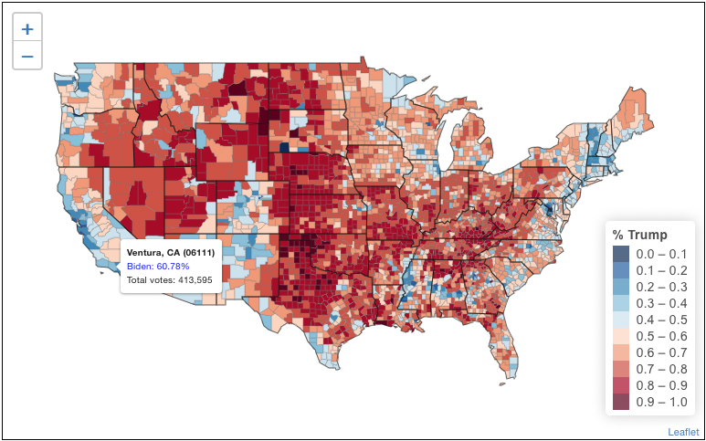

--- 
title: "US Presidential Election Data Visualization"
author: Alec Nguyen^[https://alecng27.github.io/Project_Portfolio/], Bruno Sotelo, Michael Zhang
site: bookdown::bookdown_site
link-citations: yes
---

# About {-}

Project Source Code - https://github.com/alecng27/US_Presidential_Election_Map

See the [LICENSE](https://github.com/alecng27/US_Presidential_Election_Map/blob/main/LICENSE) file for license rights and limitations.

The **American Community Survey (ACS)** is a demographics survey program conducted by the **U.S. Census Bureau**. 

**ACS** regularly gathers information previously contained only in the long form of the decennial census, such as `ancestry`, `citizenship`, `educational attainment`, `income`, `language proficiency`, `migration`, `disability`, `employment`, and `housing characteristics`. These data are used by many public-sector, private-sector, and not-for-profit stakeholders to allocate funding, track shifting demographics, plan for emergencies, and learn about local communities.

For this project, I utilized the **2019 ACS data** to explore and compare the **2020 US Presidential Election results** against the county-level demographic data.

